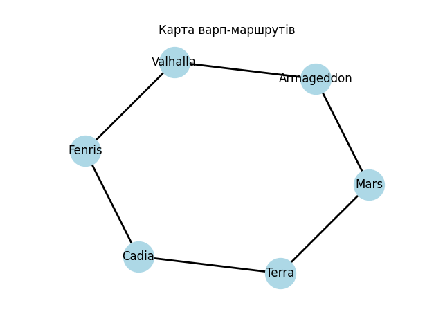

# Домашнє завдання 6: Графи та алгоритми

## Граф
Граф Warhammer 40000 - це набір точок (світи) з'єднаних лініями (маршрути). У цьому завданні - це варп-маршрути між світами
[Warhammer 40,000](https://uk.wikipedia.org/wiki/Warhammer_40,000).

---

## Task 1 - Побудова карти

Створюємо граф з 6 світів та 6 маршрутів між ними. Програма виводить інформацію про сітку та малює візуальну карту.

**Карта варп-маршрутів:**



**Вивід програми:**
```
(venv) PS C:\Users\dmitz\Documents\GitHub\goit-algo-hw-06> python task_1.py
Світів всього: 6
Маршрутів всього: 6
Terra: 2 маршрутів
Mars: 2 маршрутів
Cadia: 2 маршрутів
Fenris: 2 маршрутів
Armageddon: 2 маршрутів
Valhalla: 2 маршрутів
```

---

## Task 2 - DFS та BFS

Два способи знайти шлях між світами:
- **DFS** - ідемо в глибину, глиблі і глиблі
- **BFS** - ідемо шарами, спочатку сусідів, потім сусідів сусідів (знаходить коротший шлях)

**Вивід програми:**
```
(venv) PS C:\Users\dmitz\Documents\GitHub\goit-algo-hw-06> python task_2.py
Пошук маршруту від Terra до Valhalla:

DFS: Terra -> Mars -> Armageddon -> Valhalla (4 світів)
BFS: Terra -> Mars -> Armageddon -> Valhalla (4 світів)
```

---

## Task 3 - Алгоритм Дейкстри

Знаходить найбезпечніший маршрут. Кожен маршрут має "небезпеку" (число), треба знайти шлях з найменшою сумою.

**Вивід програми:**
```
(venv) PS C:\Users\dmitz\Documents\GitHub\goit-algo-hw-06> python task_3.py
Найбезпечніший маршрут від Terra до Valhalla:

Шлях: Terra -> Cadia -> Fenris -> Valhalla
Сумарна небезпека: 6
```

